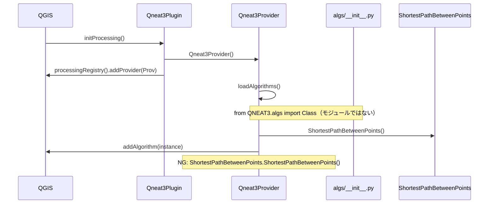
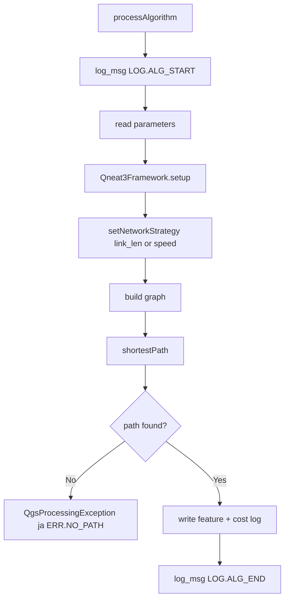
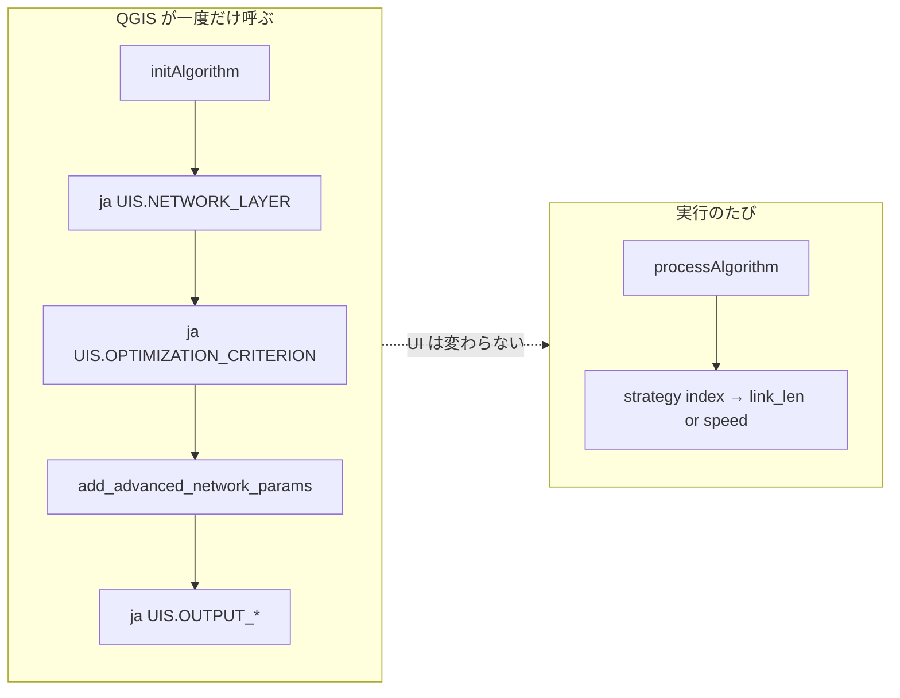
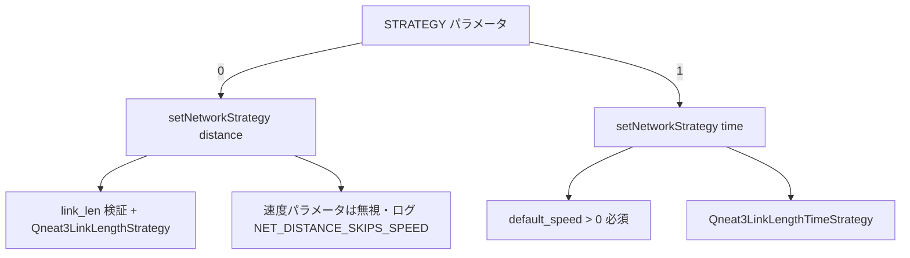

# QNEAT3 NEO — コード追跡・呼び出し整合

設計段階で「定義と参照の不一致」を潰すための正本。ZIP 作成前に `scripts/validate_all_symbol_refs.py` を必ず実行する。

## 1. シンボル台帳（単一ソース）

| 台帳 | 定義ファイル | 参照パターン | 検証 |
|------|--------------|--------------|------|
| UI ラベル | `Qneat3Strings.UIS` | `ja(UIS.*)` | validate_all_symbol_refs |
| ログ | `Qneat3Strings.LOG` | `log_msg(feedback, LOG.*, ...)` | 同上 |
| エラー | `Qneat3Strings.ERR` | `ja(ERR.*)` | 同上 |
| ヘルプ HTML | `Qneat3HelpJa.help_*` | `help_*()` in `shortHelpString` | 同上 |

**禁止:** `algs/*.py` で `self.tr(UIS.xxx)`（`ja()` を使う）。一括置換スクリプト実行後は必ず検証。

### UIS 出力名（正規 + 別名）

| 正規名 | 別名（後方互換） | 用途 |
|--------|------------------|------|
| `OUTPUT_POINTCLOUD` | `OUTPUT_ISO_POINTCLOUD` | 等時点クラウド出力 |
| `OUTPUT_CONTOURS` | `OUTPUT_ISO_CONTOURS` | 等値線出力 |
| `OUTPUT_POLYGONS` | `OUTPUT_ISO_POLYGONS` | ポリゴン出力 |

## 2. 起動・登録フロー（Processing プロバイダ）



## 3. 典型アルゴリズム実行フロー（最短経路）



## 4. initAlgorithm フェーズ（パラメータ UI）



**仕様:** 最適化基準を変えても `initAlgorithm` は再実行されない → パラメータ一覧は固定。コストは `processAlgorithm` 内の `Qneat3Framework` で切替。

## 5. 距離最適化 vs 時間最適化（コストの使い分け）

| 要素 | strategy=0 最短距離 | strategy=1 最速 |
|------|---------------------|-----------------|
| グラフ辺コスト | `Qneat3LinkLengthStrategy`（link_len） | `Qneat3LinkLengthTimeStrategy`（link_len÷速度） |
| 速度フィールド | **未使用** | 使用（無効時はデフォルト速度） |
| デフォルト速度 | **未使用**（0 可） | **必須**（正の km/h、接続コストにも使用） |
| 接続コスト（entry/exit） | **距離**（m） | 実測直線距離÷速度（時間） |

式の詳細: [COST_FORMULAS.md](COST_FORMULAS.md)



## 5b. ネットワーク前処理・経路形状（1.0.23）

| 部品 | 役割 | ファイル |
|------|------|----------|
| 前処理コア | 端点スナップ・リンク分割・link_len 按分・連結成分（純粋関数・QGIS 非依存） | `Qneat3NetworkPrep.py` |
| 前処理アルゴリズム | QGIS 接着（実測長・属性・出力） | `algs/NetworkPrepareLinks.py` |
| エッジ形状索引 | グラフ辺 → 元リンク形状（コスト照合で並行リンクを区別） | `Qneat3EdgeGeometryIndex.py` |
| 経路復元 | 辺を実形状でなぎ、entry/exit は従来通り直線 | `Qneat3Utilities.reconstruct_path_geometry` |

- 索引は `Qneat3Network.__init__` で構築（`net.edge_geometry_index`、コスト計算には不使用）
- グリッド量子化は **floor**（`round` だと許容差ちょうどの 2 点が 2 セル離れ取りこぼす）
- 形状を引けない辺は直線描画＋`LOG.PATH_GEOM_FALLBACK` で件数報告（静かな失敗を防ぐ）

## 6. 以前の監査で漏れた理由（再発防止）

| 実施していたこと | 漏れていたこと |
|------------------|----------------|
| link_len / 戦略のロジック追跡 | `UIS.*` **定義台帳と参照の機械照合** |
| Processing UI が変わらない件の仕様確認 | 一括置換スクリプトと `Qneat3Strings.py` の**同期** |
| Provider `addAlgorithm` の手動修正 | ZIP 前の**自動ゲート** |

**対策:** `pack_plugin_zip.ps1` → `validate_metadata.py` + **`validate_all_symbol_refs.py`** を必須化。

## 7. link_len エラー（方針 B）

| コード | ERR 定数 | 条件 |
|--------|----------|------|
| FIELD_NAME_EMPTY | `ERR.LINK_LEN_FIELD_EMPTY` | フィールド名未指定 |
| FIELD_NOT_IN_LAYER | `ERR.LINK_LEN_FIELD_MISSING` | レイヤにフィールドなし |
| VALUE_NULL | `ERR.LINK_LEN_VALUE_NULL` | NULL / 空 |
| VALUE_NOT_NUMERIC | `ERR.LINK_LEN_VALUE_NOT_NUMERIC` | 数値化不可 |
| VALUE_NOT_POSITIVE | `ERR.LINK_LEN_VALUE_NOT_POSITIVE` | 0 以下 |

実装: `Qneat3NetworkErrors.py` → `QgsProcessingException(ERR.LINK_LEN_HEADER + …)`  
距離最適化のみ。時間最適化の速度 0 は `ERR.DEFAULT_SPEED_INVALID`（距離時は検証しない）。

## 8. チェックコマンド

```powershell
cd H:\CURSOR\QNEAT3
python TEST.py
```

（内部で `validate_*`・`verify_provider_register`・構文/UTF-8/アイコン等を一括実行）

すべて exit 0 のあと ZIP 作成。

### コンテナ実機スモーク（「QGIS検証」、1.0.23〜）

```powershell
docker build -f docker/Dockerfile -t qgis-neo-verify:latest .
docker run --rm -v "${PWD}\docker\out:/out" qgis-neo-verify:latest
```

スタブ単体テストでは検出できない SIP 型変換・import 漏れを `qgis_process` 実機で検出する
（詳細: `docker/README.md`）。ZIP 作成前に `SMOKE PASS` を確認。

## 9. UI とオフネットワーク目的地（運用メモ）

| UI（メイン） | 最適化基準 → 最短 / 最速 |
| UI（高度） | リンク長フィールド（両モード必須・既定 `link_len`）、最速時は速度系 |

**道路データが無い地点に目的地を置いた場合**

1. `QgsVectorLayerDirector.makeGraph` が **全ネットワークから最寄り道路** に結線（即「データ無しエラー」ではない）
2. 接続コスト（entry/exit）に **長い直線** が乗ることがある
3. 始点側グラフと **非連結** なら: 2点最短 → `ERR.NO_PATH`、OD → コスト列 NULL
4. カバー外拒否は未実装（別途空間チェック）

AI 向け正本: `.cursor/rules/35-qneat3-neo.mdc`
