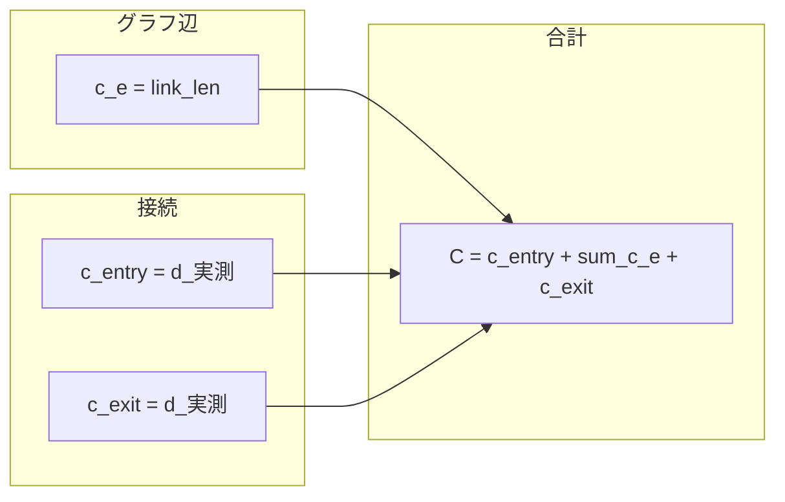
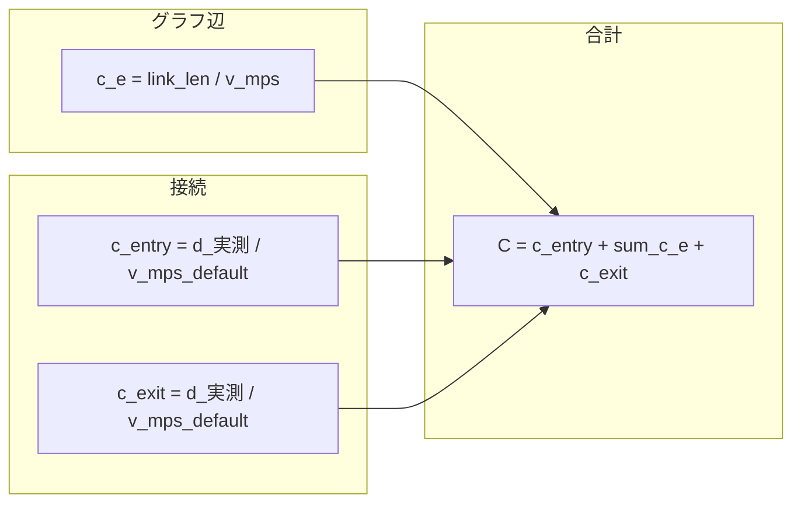

# QNEAT3 NEO — コスト計算式（式のみ）

アルゴリズム全体のフローは [CODE_TRACE.md](CODE_TRACE.md) を参照。

## 記号

| 記号 | 意味 |
|------|------|
| `link_len` | ネットワーク線レイヤのリンク長属性（高度パラメータで指定、既定 `link_len`）[m] |
| `d_実測` | 解析点と最近傍ネットワーク頂点の直線距離（楕円体 or 平面）[m] |
| `v` | 速度 [km/h]（速度フィールド、無効時はデフォルト速度） |
| `v_mps` | `v × 1000 / 3600` [m/s] |

**共通:** グラフ構築時に QGIS が渡すエッジ部分の形状長 `distance` は **どちらのモードでもコストに使わない**。

## 距離最適化（strategy = 0）

| 要素 | 式 | 単位 |
|------|-----|------|
| グラフ辺 `c_e` | `link_len` | m |
| 接続 `c_entry`, `c_exit` | `d_実測` | m |
| 合計 `C` | `c_entry + Σ c_e + c_exit` | m |

## 時間最適化（strategy = 1）

| 要素 | 式 | 単位 |
|------|-----|------|
| グラフ辺 `c_e` | `link_len / v_mps` | s |
| 接続 `c_entry`, `c_exit` | `d_実測 / v_mps_default` | s |
| 合計 `C` | `c_entry + Σ c_e + c_exit` | s |

## 実装クラス

| モード | グラフ辺 | ファイル |
|--------|----------|----------|
| 0 | `Qneat3LinkLengthStrategy` | `Qneat3LinkLengthStrategy.py` |
| 1 | `Qneat3LinkLengthTimeStrategy` | `Qneat3LinkLengthTimeStrategy.py` |

## 経路ラインの形状

出力ラインジオメトリは通過リンクの座標を結んだもの。**数値コストの算出には使わない**（`reconstruct_shortest_path_polyline`）。
