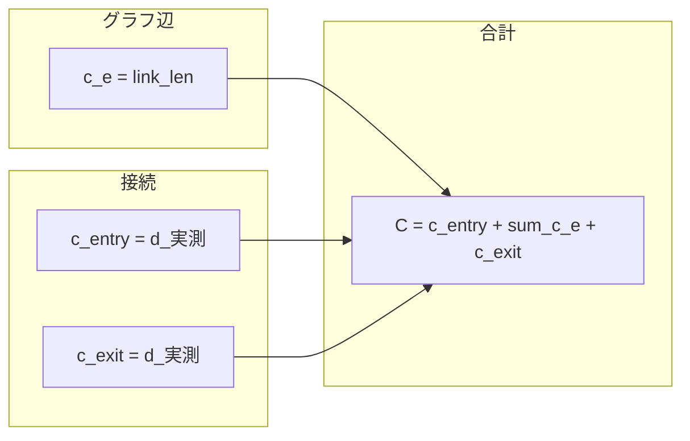
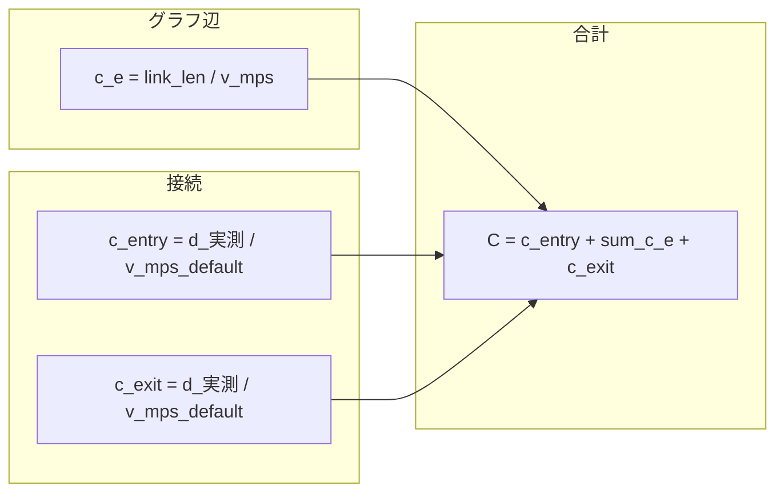

# QNEAT3 NEO — コスト計算式（式のみ）

アルゴリズム全体のフローは [CODE_TRACE.md](CODE_TRACE.md) を参照。

## 記号

| 記号 | 意味 |
|------|------|
| `link_len` | ネットワーク線レイヤのリンク長属性（高度パラメータで指定、既定 `link_len`）[m] |
| `d_実測` | 解析点と最近傍ネットワーク頂点の直線距離（楕円体 or 平面）[m] |
| `v` | 速度 [km/h]（速度フィールド、無効時はデフォルト速度） |
| `v_mps` | `v × 1000 / 3600` [m/s] |

**共通:** グラフ構築時に QGIS が渡すエッジ部分の形状長 `distance` は **どちらのモードでもコストに使わない**。

## 距離最適化（strategy = 0）

| 要素 | 式 | 単位 |
|------|-----|------|
| グラフ辺 `c_e` | `link_len` | m |
| 接続 `c_entry`, `c_exit` | `d_実測` | m |
| 合計 `C` | `c_entry + Σ c_e + c_exit` | m |

## 時間最適化（strategy = 1）

| 要素 | 式 | 単位 |
|------|-----|------|
| グラフ辺 `c_e` | `link_len / v_mps` | s |
| 接続 `c_entry`, `c_exit` | `d_実測 / v_mps_default` | s |
| 合計 `C` | `c_entry + Σ c_e + c_exit` | s |

## 実装クラス

| モード | グラフ辺 | ファイル |
|--------|----------|----------|
| 0 | `Qneat3LinkLengthStrategy` | `Qneat3LinkLengthStrategy.py` |
| 1 | `Qneat3LinkLengthTimeStrategy` | `Qneat3LinkLengthTimeStrategy.py` |

## 経路ラインの形状（1.0.23〜）

出力ラインジオメトリは通過リンクの**実形状**をなぞる（`reconstruct_path_geometry` + `EdgeGeometryIndex`）。

- グラフ辺の両端頂点座標から元リンク形状を引き、向きを通過方向に合わせて継ぐ
- 継ぎ目の両端はグラフ頂点座標に合わせる（連続性保証）
- リンク形状を特定できない辺は頂点間直線にフォールバックし、件数をログ出力（`PATH_GEOM_FALLBACK`）
- entry/exit（点↔最寄り頂点）は従来通り直線

**数値コストの算出にジオメトリは使わない**（コストは引き続き link_len 系のみ）。

## ネットワーク前処理（NetworkPrepareLinks、1.0.23〜）

架空・手描き道路の接続用。ルーティングのコスト式は変えない。

| 処理 | 式・規則 |
|------|----------|
| 端点スナップ | 他リンク端点が許容差内で別リンクの途中 → 射影点で分割＋吸着。端点同士 → 座標一致 |
| `link_len` 補完 | 未入力・不正のみ `実測長`（楕円体）で補完（既定 ON） |
| 分割時の按分 | `部分 link_len = 元 link_len × (部分の平面長 / 全体の平面長)`（合計は保存） |
| 交差分割 | 行わない（途中×途中の交差＝立体交差として非接続を保持） |
